# Analyze naturally occurring mutations at sites of strong escape
This Python Jupyter notebook sees how many naturally occuring mutations are observed at each site of strong escape

## Set up analysis
Import Python modules:


```python
import collections
import copy
import math
import os

import dms_variants.utils

from IPython.display import display, HTML

import matplotlib.pyplot as plt

import pandas as pd

from plotnine import *

import yaml
```

Read the configuration file:


```python
with open('config.yaml') as f:
    config = yaml.safe_load(f)
```

Read escape profiles config, which tells which sets to make plots for:


```python
with open(config['escape_profiles_config']) as f:
    escape_profiles_config = yaml.safe_load(f)
```

Create output directory:


```python
os.makedirs(config['gisaid_mutations_dir'], exist_ok=True)
```

Read counts of naturally ocurring mutations:


```python
print(f"Reading mutation counts from {config['gisaid_mutation_counts']}")

mut_counts = pd.read_csv(config['gisaid_mutation_counts'])
```

    Reading mutation counts from results/GISAID_mutations/mutation_counts.csv


Read sites of "strong escape" from all antibodies / sera:


```python
print(f"Reading sites of strong escape from {config['strong_escape_sites']}")

strong_sites = pd.read_csv(config['strong_escape_sites'])
```

    Reading sites of strong escape from results/escape_profiles/strong_escape_sites.csv


Read escape fractions for all antibodies / sera:


```python
print(f"Reading escape fractions from {config['escape_fracs']}")

escape_fracs = (
    pd.read_csv(config['escape_fracs'])
    .query('library == "average"')
    .drop(columns='site')
    .rename(columns={'mutation': 'mutant',
                     'label_site': 'site'})
    [['condition', 'site', 'wildtype', 'mutant', config['mut_metric'], config['site_metric']]]
    )

escape_fracs
```

    Reading escape fractions from results/escape_scores/escape_fracs.csv


<div>
<style scoped>
    .dataframe tbody tr th:only-of-type {
        vertical-align: middle;
    }

    .dataframe tbody tr th {
        vertical-align: top;
    }

    .dataframe thead th {
        text-align: right;
    }
</style>
<table border="1" class="dataframe">
  <thead>
    <tr style="text-align: right;">
      <th></th>
      <th>condition</th>
      <th>site</th>
      <th>wildtype</th>
      <th>mutant</th>
      <th>mut_escape_frac_epistasis_model</th>
      <th>site_total_escape_frac_epistasis_model</th>
    </tr>
  </thead>
  <tbody>
    <tr>
      <th>0</th>
      <td>2196+2130_400</td>
      <td>331</td>
      <td>N</td>
      <td>A</td>
      <td>0.002957</td>
      <td>0.04652</td>
    </tr>
    <tr>
      <th>1</th>
      <td>2196+2130_400</td>
      <td>331</td>
      <td>N</td>
      <td>D</td>
      <td>0.002916</td>
      <td>0.04652</td>
    </tr>
    <tr>
      <th>2</th>
      <td>2196+2130_400</td>
      <td>331</td>
      <td>N</td>
      <td>E</td>
      <td>0.002804</td>
      <td>0.04652</td>
    </tr>
    <tr>
      <th>3</th>
      <td>2196+2130_400</td>
      <td>331</td>
      <td>N</td>
      <td>F</td>
      <td>0.003562</td>
      <td>0.04652</td>
    </tr>
    <tr>
      <th>4</th>
      <td>2196+2130_400</td>
      <td>331</td>
      <td>N</td>
      <td>G</td>
      <td>0.003011</td>
      <td>0.04652</td>
    </tr>
    <tr>
      <th>...</th>
      <td>...</td>
      <td>...</td>
      <td>...</td>
      <td>...</td>
      <td>...</td>
      <td>...</td>
    </tr>
    <tr>
      <th>54547</th>
      <td>REGN10987_400</td>
      <td>531</td>
      <td>T</td>
      <td>R</td>
      <td>0.002305</td>
      <td>0.04055</td>
    </tr>
    <tr>
      <th>54548</th>
      <td>REGN10987_400</td>
      <td>531</td>
      <td>T</td>
      <td>S</td>
      <td>0.002368</td>
      <td>0.04055</td>
    </tr>
    <tr>
      <th>54549</th>
      <td>REGN10987_400</td>
      <td>531</td>
      <td>T</td>
      <td>V</td>
      <td>0.002198</td>
      <td>0.04055</td>
    </tr>
    <tr>
      <th>54550</th>
      <td>REGN10987_400</td>
      <td>531</td>
      <td>T</td>
      <td>W</td>
      <td>0.001965</td>
      <td>0.04055</td>
    </tr>
    <tr>
      <th>54551</th>
      <td>REGN10987_400</td>
      <td>531</td>
      <td>T</td>
      <td>Y</td>
      <td>0.002373</td>
      <td>0.04055</td>
    </tr>
  </tbody>
</table>
<p>54552 rows × 6 columns</p>
</div>


## Counts of mutations at sites of escape
Get counts of naturally occurring mutations at sites of escape, along with the actual escape values:

First get mutation-level counts:


```python
mutcounts_strong_sites = (
    strong_sites[['condition', 'threshold', 'site']]
    .merge(mut_counts, how='inner', on='site')
    .merge(escape_fracs[['condition', 'site', 'wildtype', config['site_metric']]].drop_duplicates(),
           on=['condition', 'site', 'wildtype'],
           validate='many_to_one')
    .assign(mutation=lambda x: x['wildtype'] + x['site'].astype(str) + x['mutant'])
    .sort_values('count', ascending=False)
    )
```

Now get site-level counts (aggregating all mutations at a site):


```python
sitecounts_strong_sites = (
    mutcounts_strong_sites
    .assign(mut_count=lambda x: x['mutation'] + ' (' + x['count'].astype(str) + ')')
    .groupby(['condition', 'threshold', 'site', 'wildtype', config['site_metric']])
    .aggregate({'count': 'sum', 'mut_count': ', '.join})
    .rename(columns={'mut_count': 'counts_by_mutation'})
    .reset_index()
    .sort_values('count', ascending=False)
    )

print(f"Here are first few lines showing the most frequently mutated sites of escape:")
display(HTML(sitecounts_strong_sites.head(n=20).to_html(index=False)))
```

    Here are first few lines showing the most frequently mutated sites of escape:


<table border="1" class="dataframe">
  <thead>
    <tr style="text-align: right;">
      <th>condition</th>
      <th>threshold</th>
      <th>site</th>
      <th>wildtype</th>
      <th>site_total_escape_frac_epistasis_model</th>
      <th>count</th>
      <th>counts_by_mutation</th>
    </tr>
  </thead>
  <tbody>
    <tr>
      <td>COV-021_500</td>
      <td>sensitive</td>
      <td>501</td>
      <td>N</td>
      <td>0.4103</td>
      <td>11434</td>
      <td>N501Y (11216), N501T (209), N501S (6), N501I (3)</td>
    </tr>
    <tr>
      <td>COV2-2499_400</td>
      <td>sensitive_max_mut</td>
      <td>501</td>
      <td>N</td>
      <td>0.5019</td>
      <td>11434</td>
      <td>N501Y (11216), N501T (209), N501S (6), N501I (3)</td>
    </tr>
    <tr>
      <td>CB6_400</td>
      <td>sensitive_max_mut</td>
      <td>501</td>
      <td>N</td>
      <td>1.4430</td>
      <td>11434</td>
      <td>N501Y (11216), N501T (209), N501S (6), N501I (3)</td>
    </tr>
    <tr>
      <td>COV2-2499_400</td>
      <td>sensitive</td>
      <td>501</td>
      <td>N</td>
      <td>0.5019</td>
      <td>11434</td>
      <td>N501Y (11216), N501T (209), N501S (6), N501I (3)</td>
    </tr>
    <tr>
      <td>COV-021_500</td>
      <td>sensitive_max_mut</td>
      <td>501</td>
      <td>N</td>
      <td>0.4103</td>
      <td>11434</td>
      <td>N501Y (11216), N501T (209), N501S (6), N501I (3)</td>
    </tr>
    <tr>
      <td>CB6_400</td>
      <td>sensitive</td>
      <td>501</td>
      <td>N</td>
      <td>1.4430</td>
      <td>11434</td>
      <td>N501Y (11216), N501T (209), N501S (6), N501I (3)</td>
    </tr>
    <tr>
      <td>REGN10987_400</td>
      <td>default</td>
      <td>439</td>
      <td>N</td>
      <td>2.1500</td>
      <td>5262</td>
      <td>N439K (5262)</td>
    </tr>
    <tr>
      <td>REGN10987_400</td>
      <td>sensitive</td>
      <td>439</td>
      <td>N</td>
      <td>2.1500</td>
      <td>5262</td>
      <td>N439K (5262)</td>
    </tr>
    <tr>
      <td>REGN10987_400</td>
      <td>sensitive_max_mut</td>
      <td>439</td>
      <td>N</td>
      <td>2.1500</td>
      <td>5262</td>
      <td>N439K (5262)</td>
    </tr>
    <tr>
      <td>REGN10933_400</td>
      <td>default</td>
      <td>453</td>
      <td>Y</td>
      <td>4.1070</td>
      <td>994</td>
      <td>Y453F (994)</td>
    </tr>
    <tr>
      <td>REGN10933+REGN10987_400</td>
      <td>sensitive</td>
      <td>453</td>
      <td>Y</td>
      <td>0.1267</td>
      <td>994</td>
      <td>Y453F (994)</td>
    </tr>
    <tr>
      <td>C105_400</td>
      <td>sensitive_max_mut</td>
      <td>453</td>
      <td>Y</td>
      <td>2.0470</td>
      <td>994</td>
      <td>Y453F (994)</td>
    </tr>
    <tr>
      <td>REGN10933+REGN10987_400</td>
      <td>sensitive_max_mut</td>
      <td>453</td>
      <td>Y</td>
      <td>0.1267</td>
      <td>994</td>
      <td>Y453F (994)</td>
    </tr>
    <tr>
      <td>REGN10933_400</td>
      <td>sensitive</td>
      <td>453</td>
      <td>Y</td>
      <td>4.1070</td>
      <td>994</td>
      <td>Y453F (994)</td>
    </tr>
    <tr>
      <td>REGN10933_400</td>
      <td>sensitive_max_mut</td>
      <td>453</td>
      <td>Y</td>
      <td>4.1070</td>
      <td>994</td>
      <td>Y453F (994)</td>
    </tr>
    <tr>
      <td>C105_400</td>
      <td>sensitive</td>
      <td>453</td>
      <td>Y</td>
      <td>2.0470</td>
      <td>994</td>
      <td>Y453F (994)</td>
    </tr>
    <tr>
      <td>C105_400</td>
      <td>default</td>
      <td>453</td>
      <td>Y</td>
      <td>2.0470</td>
      <td>994</td>
      <td>Y453F (994)</td>
    </tr>
    <tr>
      <td>COV-021_500</td>
      <td>sensitive</td>
      <td>484</td>
      <td>E</td>
      <td>2.5080</td>
      <td>615</td>
      <td>E484K (536), E484Q (54), E484A (8), E484G (7), E484D (6), E484R (3), E484V (1)</td>
    </tr>
    <tr>
      <td>COV-021_500</td>
      <td>sensitive_max_mut</td>
      <td>484</td>
      <td>E</td>
      <td>2.5080</td>
      <td>615</td>
      <td>E484K (536), E484Q (54), E484A (8), E484G (7), E484D (6), E484R (3), E484V (1)</td>
    </tr>
    <tr>
      <td>REGN10933_400</td>
      <td>sensitive_max_mut</td>
      <td>484</td>
      <td>E</td>
      <td>2.9970</td>
      <td>615</td>
      <td>E484K (536), E484Q (54), E484A (8), E484G (7), E484D (6), E484R (3), E484V (1)</td>
    </tr>
  </tbody>
</table>


## Plot sites of escape with natural variation
We perform analyses on all subsets in the escape profiles config for which this is specified:


```python
for name, specs in escape_profiles_config.items():
    if 'analyze_natural_mutations' not in specs or not specs['analyze_natural_mutations']:
        continue
    print(f"\nAnalyzing natural mutations for {name}")
    
    conditions = specs['conditions']
    
    threshold = specs['plot_auto_identified_sites']
    if threshold not in sitecounts_strong_sites['threshold'].unique():
        raise ValueError(f"invalid threshold {threshold} for {name}")
    
    # get count for conditions of interest for this subset
    df = (sitecounts_strong_sites
          .query('condition in @conditions')
          .query('threshold == @threshold')
          .assign(condition=lambda x: x['condition'].map(conditions))
          .drop(columns=config['site_metric'])
          )
    countsfile = os.path.join(config['gisaid_mutations_dir'], f"{name}_mutation_counts.csv")
    print(f"Writing counts of mutations at sites of strong escape to {countsfile}. First few lines:")
    display(HTML(df.head(n=10).to_html(index=False)))
    df.to_csv(countsfile, index=False)
    
    # make plot showing escape sites with more than mincounts mutations
    if 'natural_mutations_mincounts' in specs:
        mincounts = specs['natural_mutations_mincounts']
    else:
        mincounts = 5
    plotsfile = os.path.join(config['gisaid_mutations_dir'], f"{name}_mutation_counts.pdf")
    print('Plotting which antibodies / sera are escaped by mutations at all sites of '
          f"escape with at least {mincounts} mutation counts and saving to {plotsfile}.")
    plot_df = (
        # data frame with all combinations of conditions and sites
        pd.DataFrame.from_records([(condition, site) for condition in conditions.values()
                                   for site in df['site'].unique()],
                                  columns=['condition', 'site'])
        # annotate sites of escape
        .merge(df.assign(escape=lambda x: x['count'] >= mincounts)[['condition', 'site', 'escape']],
               how='left',
               validate='one_to_one',
               on=['condition', 'site'])
        .assign(escape=lambda x: x['escape'].fillna(False))
        # add wildtype and counts of mutations at each site
        .merge(sitecounts_strong_sites[['site', 'wildtype', 'count']].drop_duplicates(),
               how='left',
               validate='many_to_one',
               on='site')
        # get only sites with sufficient mutation counts
        .query('count > @mincounts')
        # only get sites where at least one antibody escapes
        .assign(n_escape=lambda x: x.groupby('site')['escape'].transform('sum'))
        .query('n_escape > 0')
        # order conditions, and order sites by count after making nice label
        .assign(site_label=lambda x: x['wildtype'] + x['site'].astype(str) + ' (' + x['count'].astype(str) + ')')
        .sort_values('count')
        .assign(condition=lambda x: pd.Categorical(x['condition'], list(conditions.values()), ordered=True),
                site_label=lambda x: pd.Categorical(x['site_label'], x['site_label'].unique(), ordered=True)
                )
        )
    p = (ggplot(plot_df) +
         aes('condition', 'site_label', fill='escape') +
         geom_tile(color='black', size=0.3) +
         theme(axis_text_x=element_text(angle=90),
               figure_size=(0.3 * plot_df['condition'].nunique(), 0.3 * plot_df['site_label'].nunique()),
               panel_background=element_blank(),
               ) +
         xlab('') +
         ylab('') +
         scale_fill_manual(values=['white', 'dimgray'])
         )
    p.save(plotsfile, verbose=False)
    fig = p.draw()
    display(fig)
    plt.close(fig)
```

    
    Analyzing natural mutations for Nussenzweig_serum
    Writing counts of mutations at sites of strong escape to results/GISAID_mutations/Nussenzweig_serum_mutation_counts.csv. First few lines:


<table border="1" class="dataframe">
  <thead>
    <tr style="text-align: right;">
      <th>condition</th>
      <th>threshold</th>
      <th>site</th>
      <th>wildtype</th>
      <th>count</th>
      <th>counts_by_mutation</th>
    </tr>
  </thead>
  <tbody>
    <tr>
      <td>COV-047</td>
      <td>default</td>
      <td>484</td>
      <td>E</td>
      <td>615</td>
      <td>E484K (536), E484Q (54), E484A (8), E484G (7), E484D (6), E484R (3), E484V (1)</td>
    </tr>
    <tr>
      <td>COV-021</td>
      <td>default</td>
      <td>484</td>
      <td>E</td>
      <td>615</td>
      <td>E484K (536), E484Q (54), E484A (8), E484G (7), E484D (6), E484R (3), E484V (1)</td>
    </tr>
    <tr>
      <td>COV-057</td>
      <td>default</td>
      <td>484</td>
      <td>E</td>
      <td>615</td>
      <td>E484K (536), E484Q (54), E484A (8), E484G (7), E484D (6), E484R (3), E484V (1)</td>
    </tr>
    <tr>
      <td>COV-072</td>
      <td>default</td>
      <td>484</td>
      <td>E</td>
      <td>615</td>
      <td>E484K (536), E484Q (54), E484A (8), E484G (7), E484D (6), E484R (3), E484V (1)</td>
    </tr>
    <tr>
      <td>COV-057</td>
      <td>default</td>
      <td>446</td>
      <td>G</td>
      <td>101</td>
      <td>G446V (90), G446S (8), G446A (2), G446D (1)</td>
    </tr>
    <tr>
      <td>COV-057</td>
      <td>default</td>
      <td>490</td>
      <td>F</td>
      <td>85</td>
      <td>F490S (60), F490L (21), F490V (4)</td>
    </tr>
    <tr>
      <td>COV-047</td>
      <td>default</td>
      <td>490</td>
      <td>F</td>
      <td>85</td>
      <td>F490S (60), F490L (21), F490V (4)</td>
    </tr>
    <tr>
      <td>COV-021</td>
      <td>default</td>
      <td>455</td>
      <td>L</td>
      <td>51</td>
      <td>L455F (51)</td>
    </tr>
    <tr>
      <td>COV-047</td>
      <td>default</td>
      <td>455</td>
      <td>L</td>
      <td>51</td>
      <td>L455F (51)</td>
    </tr>
    <tr>
      <td>COV-047</td>
      <td>default</td>
      <td>485</td>
      <td>G</td>
      <td>37</td>
      <td>G485R (33), G485S (2), G485V (1), G485T (1)</td>
    </tr>
  </tbody>
</table>


    Plotting which antibodies / sera are escaped by mutations at all sites of escape with at least 5 mutation counts and saving to results/GISAID_mutations/Nussenzweig_serum_mutation_counts.pdf.


    

    


    
    Analyzing natural mutations for all_class1_abs
    Writing counts of mutations at sites of strong escape to results/GISAID_mutations/all_class1_abs_mutation_counts.csv. First few lines:


<table border="1" class="dataframe">
  <thead>
    <tr style="text-align: right;">
      <th>condition</th>
      <th>threshold</th>
      <th>site</th>
      <th>wildtype</th>
      <th>count</th>
      <th>counts_by_mutation</th>
    </tr>
  </thead>
  <tbody>
    <tr>
      <td>REGN10933</td>
      <td>default</td>
      <td>453</td>
      <td>Y</td>
      <td>994</td>
      <td>Y453F (994)</td>
    </tr>
    <tr>
      <td>C105</td>
      <td>default</td>
      <td>453</td>
      <td>Y</td>
      <td>994</td>
      <td>Y453F (994)</td>
    </tr>
    <tr>
      <td>REGN10933</td>
      <td>default</td>
      <td>484</td>
      <td>E</td>
      <td>615</td>
      <td>E484K (536), E484Q (54), E484A (8), E484G (7), E484D (6), E484R (3), E484V (1)</td>
    </tr>
    <tr>
      <td>COV2-2832</td>
      <td>default</td>
      <td>484</td>
      <td>E</td>
      <td>615</td>
      <td>E484K (536), E484Q (54), E484A (8), E484G (7), E484D (6), E484R (3), E484V (1)</td>
    </tr>
    <tr>
      <td>LY-CoV016</td>
      <td>default</td>
      <td>417</td>
      <td>K</td>
      <td>349</td>
      <td>K417N (347), K417R (2)</td>
    </tr>
    <tr>
      <td>REGN10933</td>
      <td>default</td>
      <td>417</td>
      <td>K</td>
      <td>349</td>
      <td>K417N (347), K417R (2)</td>
    </tr>
    <tr>
      <td>C105</td>
      <td>default</td>
      <td>417</td>
      <td>K</td>
      <td>349</td>
      <td>K417N (347), K417R (2)</td>
    </tr>
    <tr>
      <td>LY-CoV016</td>
      <td>default</td>
      <td>475</td>
      <td>A</td>
      <td>110</td>
      <td>A475S (59), A475V (50), A475T (1)</td>
    </tr>
    <tr>
      <td>COV2-2832</td>
      <td>default</td>
      <td>475</td>
      <td>A</td>
      <td>110</td>
      <td>A475S (59), A475V (50), A475T (1)</td>
    </tr>
    <tr>
      <td>COV2-2196</td>
      <td>default</td>
      <td>475</td>
      <td>A</td>
      <td>110</td>
      <td>A475S (59), A475V (50), A475T (1)</td>
    </tr>
  </tbody>
</table>


    Plotting which antibodies / sera are escaped by mutations at all sites of escape with at least 5 mutation counts and saving to results/GISAID_mutations/all_class1_abs_mutation_counts.pdf.


    
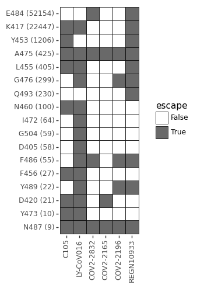
    


    
    Analyzing natural mutations for all_class2_abs
    Writing counts of mutations at sites of strong escape to results/GISAID_mutations/all_class2_abs_mutation_counts.csv. First few lines:


<table border="1" class="dataframe">
  <thead>
    <tr style="text-align: right;">
      <th>condition</th>
      <th>threshold</th>
      <th>site</th>
      <th>wildtype</th>
      <th>count</th>
      <th>counts_by_mutation</th>
    </tr>
  </thead>
  <tbody>
    <tr>
      <td>COV2-2479</td>
      <td>default</td>
      <td>484</td>
      <td>E</td>
      <td>615</td>
      <td>E484K (536), E484Q (54), E484A (8), E484G (7), E484D (6), E484R (3), E484V (1)</td>
    </tr>
    <tr>
      <td>C121</td>
      <td>default</td>
      <td>484</td>
      <td>E</td>
      <td>615</td>
      <td>E484K (536), E484Q (54), E484A (8), E484G (7), E484D (6), E484R (3), E484V (1)</td>
    </tr>
    <tr>
      <td>C144</td>
      <td>default</td>
      <td>484</td>
      <td>E</td>
      <td>615</td>
      <td>E484K (536), E484Q (54), E484A (8), E484G (7), E484D (6), E484R (3), E484V (1)</td>
    </tr>
    <tr>
      <td>COV2-2050</td>
      <td>default</td>
      <td>484</td>
      <td>E</td>
      <td>615</td>
      <td>E484K (536), E484Q (54), E484A (8), E484G (7), E484D (6), E484R (3), E484V (1)</td>
    </tr>
    <tr>
      <td>C002</td>
      <td>default</td>
      <td>484</td>
      <td>E</td>
      <td>615</td>
      <td>E484K (536), E484Q (54), E484A (8), E484G (7), E484D (6), E484R (3), E484V (1)</td>
    </tr>
    <tr>
      <td>C002</td>
      <td>default</td>
      <td>452</td>
      <td>L</td>
      <td>450</td>
      <td>L452R (385), L452M (57), L452Q (7), L452P (1)</td>
    </tr>
    <tr>
      <td>C002</td>
      <td>default</td>
      <td>483</td>
      <td>V</td>
      <td>138</td>
      <td>V483A (67), V483F (62), V483L (5), V483I (4)</td>
    </tr>
    <tr>
      <td>C121</td>
      <td>default</td>
      <td>490</td>
      <td>F</td>
      <td>85</td>
      <td>F490S (60), F490L (21), F490V (4)</td>
    </tr>
    <tr>
      <td>COV2-2479</td>
      <td>default</td>
      <td>490</td>
      <td>F</td>
      <td>85</td>
      <td>F490S (60), F490L (21), F490V (4)</td>
    </tr>
    <tr>
      <td>COV2-2050</td>
      <td>default</td>
      <td>490</td>
      <td>F</td>
      <td>85</td>
      <td>F490S (60), F490L (21), F490V (4)</td>
    </tr>
  </tbody>
</table>


    Plotting which antibodies / sera are escaped by mutations at all sites of escape with at least 5 mutation counts and saving to results/GISAID_mutations/all_class2_abs_mutation_counts.pdf.


    
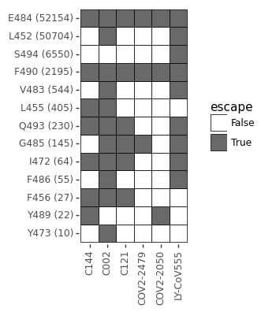
    


    
    Analyzing natural mutations for all_class3_abs
    Writing counts of mutations at sites of strong escape to results/GISAID_mutations/all_class3_abs_mutation_counts.csv. First few lines:


<table border="1" class="dataframe">
  <thead>
    <tr style="text-align: right;">
      <th>condition</th>
      <th>threshold</th>
      <th>site</th>
      <th>wildtype</th>
      <th>count</th>
      <th>counts_by_mutation</th>
    </tr>
  </thead>
  <tbody>
    <tr>
      <td>REGN10987</td>
      <td>default</td>
      <td>439</td>
      <td>N</td>
      <td>5262</td>
      <td>N439K (5262)</td>
    </tr>
    <tr>
      <td>C110</td>
      <td>default</td>
      <td>452</td>
      <td>L</td>
      <td>450</td>
      <td>L452R (385), L452M (57), L452Q (7), L452P (1)</td>
    </tr>
    <tr>
      <td>C110</td>
      <td>default</td>
      <td>494</td>
      <td>S</td>
      <td>275</td>
      <td>S494P (256), S494L (13), S494A (6)</td>
    </tr>
    <tr>
      <td>COV2-2130</td>
      <td>default</td>
      <td>494</td>
      <td>S</td>
      <td>275</td>
      <td>S494P (256), S494L (13), S494A (6)</td>
    </tr>
    <tr>
      <td>COV2-2499</td>
      <td>default</td>
      <td>446</td>
      <td>G</td>
      <td>101</td>
      <td>G446V (90), G446S (8), G446A (2), G446D (1)</td>
    </tr>
    <tr>
      <td>COV2-2130</td>
      <td>default</td>
      <td>446</td>
      <td>G</td>
      <td>101</td>
      <td>G446V (90), G446S (8), G446A (2), G446D (1)</td>
    </tr>
    <tr>
      <td>REGN10987</td>
      <td>default</td>
      <td>446</td>
      <td>G</td>
      <td>101</td>
      <td>G446V (90), G446S (8), G446A (2), G446D (1)</td>
    </tr>
    <tr>
      <td>C110</td>
      <td>default</td>
      <td>446</td>
      <td>G</td>
      <td>101</td>
      <td>G446V (90), G446S (8), G446A (2), G446D (1)</td>
    </tr>
    <tr>
      <td>C110</td>
      <td>default</td>
      <td>490</td>
      <td>F</td>
      <td>85</td>
      <td>F490S (60), F490L (21), F490V (4)</td>
    </tr>
    <tr>
      <td>REGN10987</td>
      <td>default</td>
      <td>440</td>
      <td>N</td>
      <td>70</td>
      <td>N440K (53), N440Y (11), N440D (3), N440S (2), N440T (1)</td>
    </tr>
  </tbody>
</table>


    Plotting which antibodies / sera are escaped by mutations at all sites of escape with at least 5 mutation counts and saving to results/GISAID_mutations/all_class3_abs_mutation_counts.pdf.


    
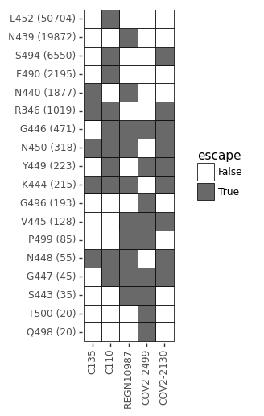
    


## Plot correlation between escape and natural frequency
First aggregate frequency of mutations and escape fractions:


```python
escape_and_freq = (
    escape_fracs
    .rename(columns={config['mut_metric']: 'mut_escape',
                     config['site_metric']: 'tot_site_escape'})
    .assign(max_site_escape=lambda x: x.groupby(['condition', 'site'])['mut_escape'].transform('max'),
            mean_site_escape=lambda x: x.groupby(['condition', 'site'])['mut_escape'].transform('mean'))
    .merge(mut_counts[['site', 'wildtype', 'mutant', 'frequency']]
                     .rename(columns={'frequency': 'mut_freq'}),
           on=['site', 'wildtype', 'mutant'],
           how='left', validate='many_to_one')
    .assign(mut_freq=lambda x: x['mut_freq'].fillna(0),
            site_freq=lambda x: x.groupby(['condition', 'site'])['mut_freq'].transform('sum'),
            mutation=lambda x: x['wildtype'] + x['site'].astype(str) + x['mutant'],
            )
    )

display(HTML(escape_and_freq.head().to_html()))
```


<table border="1" class="dataframe">
  <thead>
    <tr style="text-align: right;">
      <th></th>
      <th>condition</th>
      <th>site</th>
      <th>wildtype</th>
      <th>mutant</th>
      <th>mut_escape</th>
      <th>tot_site_escape</th>
      <th>max_site_escape</th>
      <th>mean_site_escape</th>
      <th>mut_freq</th>
      <th>site_freq</th>
      <th>mutation</th>
    </tr>
  </thead>
  <tbody>
    <tr>
      <th>0</th>
      <td>2196+2130_400</td>
      <td>331</td>
      <td>N</td>
      <td>A</td>
      <td>0.002957</td>
      <td>0.04652</td>
      <td>0.003562</td>
      <td>0.002907</td>
      <td>0.0</td>
      <td>0.000003</td>
      <td>N331A</td>
    </tr>
    <tr>
      <th>1</th>
      <td>2196+2130_400</td>
      <td>331</td>
      <td>N</td>
      <td>D</td>
      <td>0.002916</td>
      <td>0.04652</td>
      <td>0.003562</td>
      <td>0.002907</td>
      <td>0.0</td>
      <td>0.000003</td>
      <td>N331D</td>
    </tr>
    <tr>
      <th>2</th>
      <td>2196+2130_400</td>
      <td>331</td>
      <td>N</td>
      <td>E</td>
      <td>0.002804</td>
      <td>0.04652</td>
      <td>0.003562</td>
      <td>0.002907</td>
      <td>0.0</td>
      <td>0.000003</td>
      <td>N331E</td>
    </tr>
    <tr>
      <th>3</th>
      <td>2196+2130_400</td>
      <td>331</td>
      <td>N</td>
      <td>F</td>
      <td>0.003562</td>
      <td>0.04652</td>
      <td>0.003562</td>
      <td>0.002907</td>
      <td>0.0</td>
      <td>0.000003</td>
      <td>N331F</td>
    </tr>
    <tr>
      <th>4</th>
      <td>2196+2130_400</td>
      <td>331</td>
      <td>N</td>
      <td>G</td>
      <td>0.003011</td>
      <td>0.04652</td>
      <td>0.003562</td>
      <td>0.002907</td>
      <td>0.0</td>
      <td>0.000003</td>
      <td>N331G</td>
    </tr>
  </tbody>
</table>


Now make plots.
Note that you can configure below exactly what variables you want to plot (mutation frequency, mutation escape, site escape, etc):


```python
# all the parameters below have the indicated defaults, but can be set in `escape_profiles_config`
# via analyze_natural_mutations_specs
default_analysis_specs = {
    'maxcol': 5,  # maximum columns in plot
    'minfreq': 1e-5,  # collapse any natural frequencies < this
    'freq': 'site_freq',  # type of frequency to plot: mut_freq or site_freq
    'escape': 'mean_site_escape',  # type of escape to plot: mean_site_escape, mut_escape, max_site_escape, tot_site_escape
    'xlabel': 'frequency of mutations at site',
    'ylabel': 'mean escape at site',
    'label_minfreq': 5e-5,  # label points with frequency >= this and...
    'label_minescape': 0.1,  # label points with escape >= this
    'also_label': [],  # also label any points (sites or mutations) listed here
    'label_font_size': 6,  # font size for labeling points
    'default_color': 'black',  # color for points not otherwise specified
    'default_alpha': 0.5,  # default alpha if not specified
    'set_point_color': {},  # set color; key by site / mutation, value is color
    'set_point_alpha': {},  # set alpha; key by site / mutations, value is alpha
    }
label_minfreq = 5e-5  # label points with frequency >= this
label_minescape = 0.05  # label points with escape >= this

for name, specs in escape_profiles_config.items():
    if 'analyze_natural_mutations' not in specs or not specs['analyze_natural_mutations']:
        continue
    print(f"\nAnalyzing natural mutations for {name}")
    
    analysis_specs = copy.deepcopy(default_analysis_specs)
    if 'analyze_natural_mutations_specs' in specs:
        for key, val in specs['analyze_natural_mutations_specs'].items():
            analysis_specs[key] = val
    
    conditions = specs['conditions']
    
    if 'site' in analysis_specs['freq'] and 'site' in analysis_specs['escape']:
        ptlabel = 'site'
    else:
        ptlabel = 'mutation'
    
    df = (escape_and_freq
          .query('condition in @conditions')
          .assign(condition=lambda x: x['condition'].map(conditions))
          .assign(**{analysis_specs['freq']: lambda x: x[analysis_specs['freq']].clip(lower=analysis_specs['minfreq'])})
          [['condition', analysis_specs['escape'], analysis_specs['freq'], ptlabel]]
          .drop_duplicates()
          )

    assert len(conditions) == df['condition'].nunique()
    
    for avg_conditions in (False, True):
        
        if avg_conditions:
            plot_df = df.groupby(ptlabel, as_index=False).aggregate({analysis_specs['freq']: 'mean',
                                                                     analysis_specs['escape']: 'mean'})
            nrow = ncol = 1
            plotfile = os.path.join(config['gisaid_mutations_dir'],
                                    f"{name}_escape_vs_freq_average.pdf")
            print(f"Plotting average across conditions and saving to {plotfile}")
        else:
            nrow = math.ceil(len(conditions) / analysis_specs['maxcol'])
            ncol = min(len(conditions), analysis_specs['maxcol'])
            plot_df = df.copy()
            # make condition categorical to maintain order 
            plot_df=plot_df.assign(condition=lambda x: pd.Categorical(x['condition'], 
                                                                      list(conditions.values()), 
                                                                      ordered=True)
                                  )
            plotfile = os.path.join(config['gisaid_mutations_dir'],
                                    f"{name}_escape_vs_freq_by-condition.pdf")
            print(f"Plotting each condition and saving to {plotfile}")
         
        # color points and set alpha
        set_point_color = collections.defaultdict(lambda: analysis_specs['default_color'])
        set_point_alpha = collections.defaultdict(lambda: analysis_specs['default_alpha'])
        for point, color in analysis_specs['set_point_color'].items():
            set_point_color[point] = color
        for point, alpha in analysis_specs['set_point_alpha'].items():
            set_point_alpha[point] = alpha
        plot_df['color'] = plot_df[ptlabel].map(set_point_color)
        plot_df['alpha'] = plot_df[ptlabel].map(set_point_alpha)
        # need to make color categorical to assign as aesthetic
        colors = plot_df['color'].unique()
        plot_df['color'] = pd.Categorical(plot_df['color'], colors, ordered=True)
            
        label_df = (plot_df
                    .assign(label=lambda x: x[ptlabel].isin(analysis_specs['also_label']))
                    .query(f"label or ({analysis_specs['freq']} >= {analysis_specs['label_minfreq']})")
                    .query(f"label or ({analysis_specs['escape']} >= {analysis_specs['label_minescape']})")
                    )
        
        maxfreq = plot_df[analysis_specs['freq']].max()
        assert analysis_specs['minfreq'] == 10**(int(math.log10(analysis_specs['minfreq'])))
        logxbreaks = list(range(int(math.log10(analysis_specs['minfreq'])), round(math.log10(maxfreq)) + 1, 1))
        xbreaks = [10**logx for logx in logxbreaks]
        xlabels = [f"$10^{{{logx}}}$" for logx in logxbreaks]
        xlabels[0] = f"$<{xlabels[0][1:]}"
        
        p = (ggplot(plot_df) +
             aes(analysis_specs['freq'], analysis_specs['escape'], color='color', alpha='alpha') +
             geom_point() +
             geom_text(data=label_df,
                       mapping=aes(label=ptlabel),
                       size=analysis_specs['label_font_size'],
                       adjust_text={'expand_points': (1.05, 1.2),
                                    'expand_text': (1.05, 1.2)},
                       ) +
             theme_classic() +
             theme(figure_size=(2.5 * ncol, 2.5 * nrow),
                   panel_spacing=0.3,
                   legend_position='none',
                   ) +
             scale_x_log10(name=analysis_specs['xlabel'],
                           breaks=xbreaks,
                           labels=xlabels,
                           expand=(0.07, 0)) +
             ylab(analysis_specs['ylabel']) +
             scale_color_manual(values=colors) +
             scale_alpha_continuous(limits=(0, 1), range=(0, 1))
             )
        if not avg_conditions:
            p = p + facet_wrap('~ condition', ncol=ncol)
        p.save(plotfile, verbose=False)
        fig = p.draw()
        display(fig)
       # plt.close(fig)
```

    
    Analyzing natural mutations for Nussenzweig_serum
    Plotting each condition and saving to results/GISAID_mutations/Nussenzweig_serum_escape_vs_freq_by-condition.pdf


    
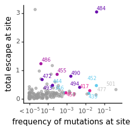
    


    Plotting average across conditions and saving to results/GISAID_mutations/Nussenzweig_serum_escape_vs_freq_average.pdf


    
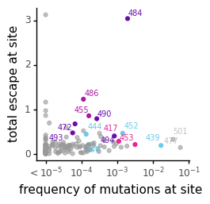
    


    
    Analyzing natural mutations for all_class1_abs
    Plotting each condition and saving to results/GISAID_mutations/all_class1_abs_escape_vs_freq_by-condition.pdf


    
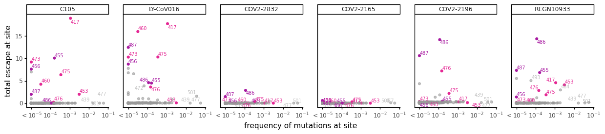
    


    Plotting average across conditions and saving to results/GISAID_mutations/all_class1_abs_escape_vs_freq_average.pdf


    
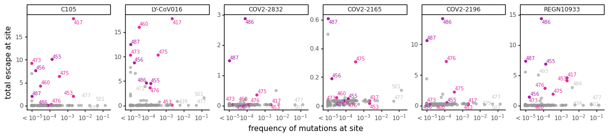
    


    
    Analyzing natural mutations for all_class2_abs
    Plotting each condition and saving to results/GISAID_mutations/all_class2_abs_escape_vs_freq_by-condition.pdf


    

    


    Plotting average across conditions and saving to results/GISAID_mutations/all_class2_abs_escape_vs_freq_average.pdf


    
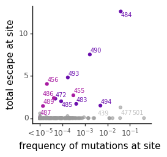
    


    
    Analyzing natural mutations for all_class3_abs
    Plotting each condition and saving to results/GISAID_mutations/all_class3_abs_escape_vs_freq_by-condition.pdf


    
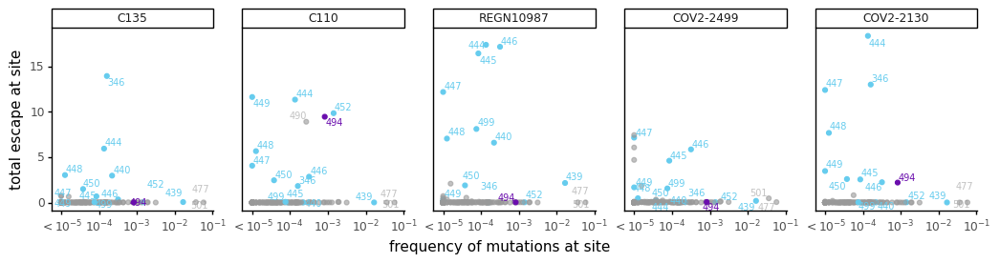
    


    Plotting average across conditions and saving to results/GISAID_mutations/all_class3_abs_escape_vs_freq_average.pdf


    
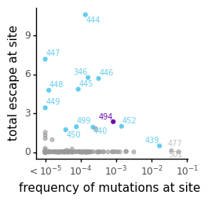
    


    
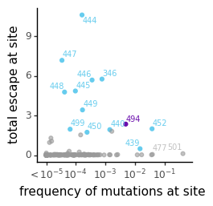
    


    
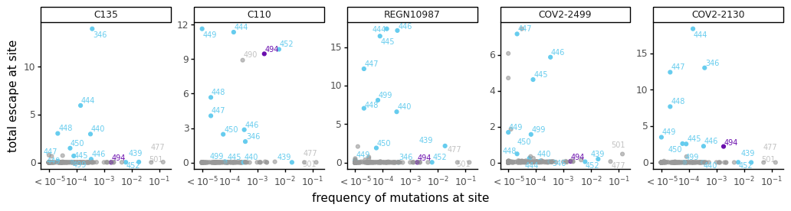
    


    
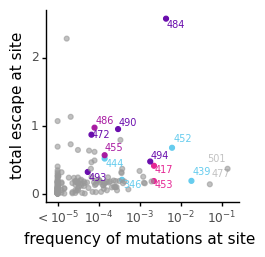
    


    
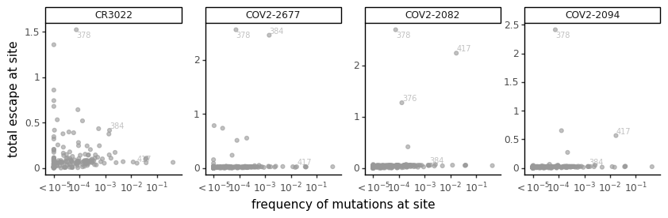
    


    

    


    
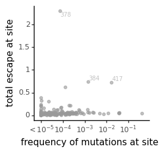
    


    
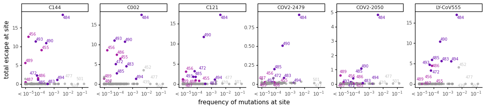
    


    
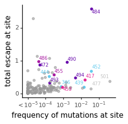
    


```python

```
